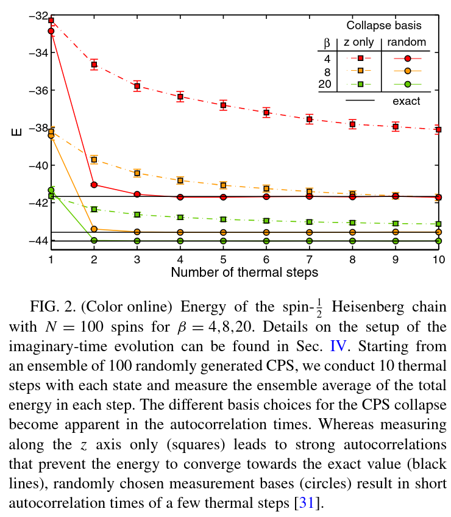

# TO-DO

## Ancilla implementation
- [ ] finite MPS
- [ ] infinite MPS

## QR-based TEBD
- [ ] Implement QR-based TEBD for MPS [3]

## METTS benchmark
Goal: plots similar to [2]

- [ ] finite MPS
  - [x] Heisenberg spin 1/2

- Do 100 independent runs
- Take N_samples = 10 (_thermal steps_)
- Take the average of the 100 runs at each thermal step
- Run for beta=4, 6, 20
- [ ] proper treatment of error

- Question:
  - sample over more thermal steps vs sample over independent runs

## METTS implementation
- Time-series processing
  - Averaging
  - Std estimation

- Symmetric tensors
  
## tanRG
## xTRG

# References
[1] M. Binder and T. Barthel, Minimally entangled typical thermal states versus matrix product purifications for the simulation of equilibrium states and time evolution, Phys. Rev. B 92, 125119 (2015).
[2] B. Bruognolo, J. von Delft, and A. Weichselbaum, Symmetric minimally entangled typical thermal states, Phys. Rev. B 92, 115105 (2015).
[3] J. Unfried, J. Hauschild, and F. Pollmann, Fast time evolution of matrix product states using the QR decomposition, Phys. Rev. B 107, 155133 (2023).
